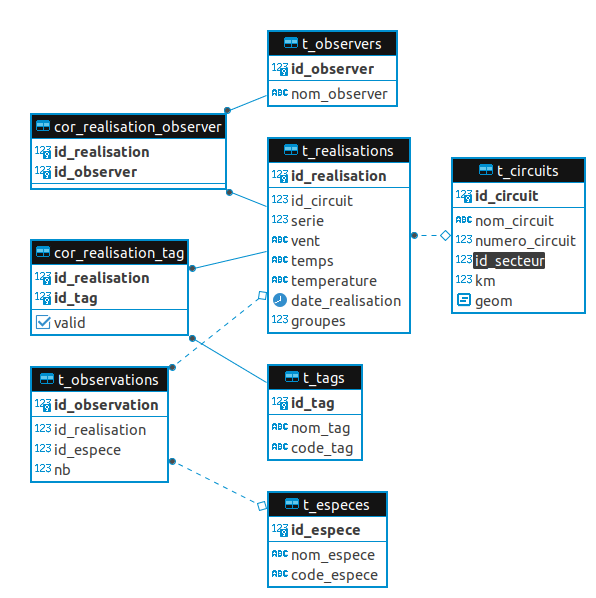
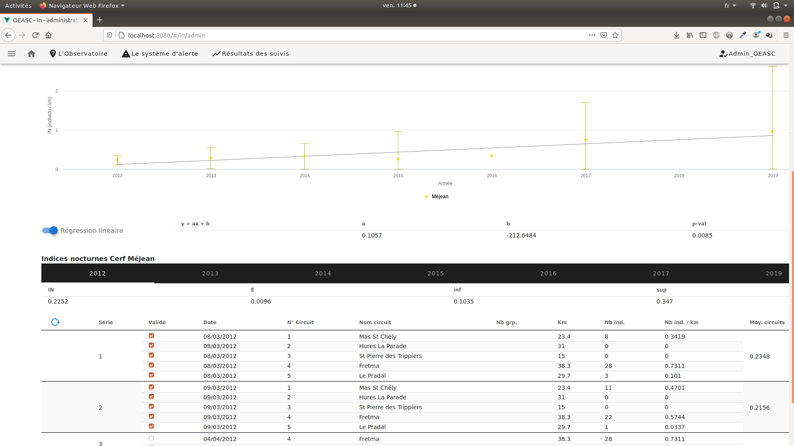
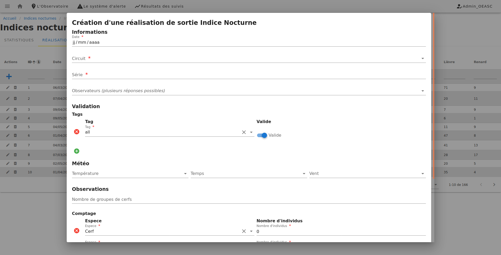
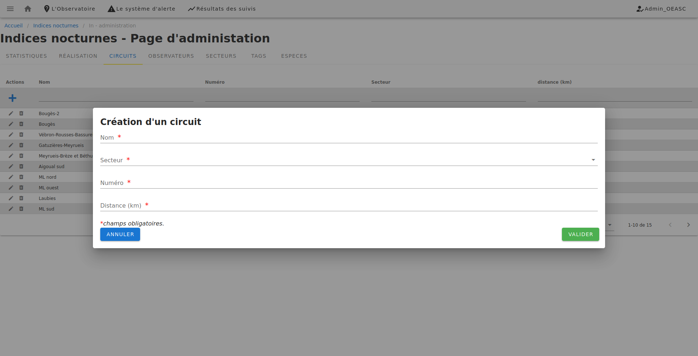
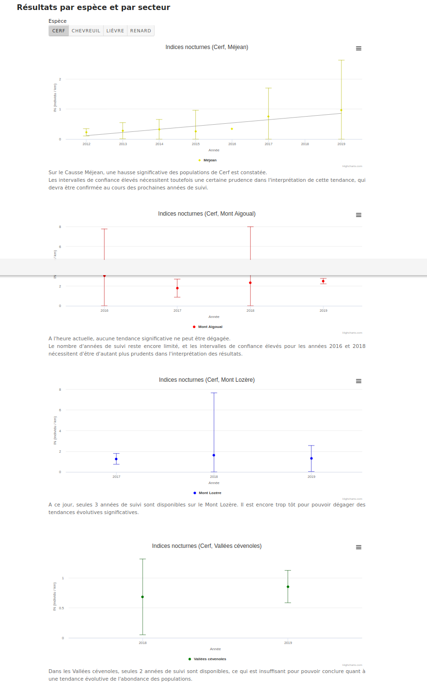

# Indices Nocturnes

## Modélisation



## Administration

L'administration des données des Indices Nocturnes est accessible depuis le menu de gauche (sous-menu `Administration`) ou directement à l'adresse `#/in/admin`.

Il faut être connecté et avoir les droit >= 5 pour pouvoir y accéder.

### Statistiques
Cet onglet permet de :
- voir les données des Indices Nocturnes classées par espèce, secteur et années  sous forme de tableaux et de graphiques

- valider/invalider les réalisations:
  - cliquer sur `recharger` pour mettre à jour les graphiques 

### Réalisations

Cet onglet permet de 
- voir les données des réalisaion.
- éditer les données /déclarer de nouvelles réalisation.
  - les réalisation peuvent être validées pour des tags différents 
  - les utilisateurs peuvent être saisis à la volée.
  



### Circuits




### Tags

Gestion des tags.

Les Tags déjà présents sont `all` et `coeur`.
Les tags permettent de valider une réalisation pour des contextes différents (par exemple `Méjean` et `Méjean  coeur`) sans avoir à dupliquer les circuits et les réalisations;

### Espèces

Gestion des espèces.

Les espèces déjà présentes sont les cerfs, chevreuils, renards, lièvres.

### Observateurs

Gestion des observateurs.

## Resultats

Les résutats des Indices nocturnes sont accéssible à tous depuis le menu horizontal `Résultats des suivi -> Indices Nocturnes` ou directement à l'adresse `resultats/in`.

Il s'agit d'une page de contenu.

Pour intégrer les graphiques il faut placer les lignes suivante dans le contenu.

```
## Résultats par espèce et par secteur

<div><in-table graphOnly
:commentaires="{
  Cerf: {
    'Méjean': 'Commentaire cerf Méjan ...',
    'Mont Aigoual': '',
    'Mont Lozère': '',
    'Vallées cévenoles': '',
    'Méjean_coeur': '',
  },
  Chevreuil: {
    'Méjean': 'Commentaire cerf Méjan ...',
    'Mont Aigoual': '',
    'Mont Lozère': '',
    'Vallées cévenoles': '',
    'Méjean_coeur': '',
  },
}"
></in-table></div>
```

Les graphiques présentent les résultats par secteurs pour une espèce choisie.

- Les commentaires peuvent contenir du html.
- Le caractère `'` doit être échappé `\'`.



